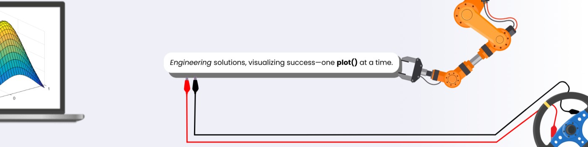

  

I am a **Mechatronics Engineer** specializing in **Embedded Systems, Hardware-in-the-Loop (HIL) Testing, Industrial Automation, and Data Engineering**. 
I bridge the gap between low-level hardware control and scalable data architecture, with experience driving automation and advanced analytics in international manufacturing environments.

- 🏎️ **What I do:** Design robust, concurrent software to control and validate real-world industrial hardware.
- 🛠️ **Core Stack:** C/C++ for Embedded systems & Python.
- 🎓 **Background:** Dual Degree graduate from **Tecnológico de Monterrey** (Mexico) and **Hochschule Esslingen** (Germany).

---

## 🔗 Connect with Me

  
  

---

## 🛠️ Technical Tech Stack
⚡ Embedded Systems & Automation
`C` `C++` `STM32` `ESP32` `FreeRTOS` `MicroPython` `HIL Testing` `CAN / I2C / SPI Protocols` `MATLAB / Simulink`

📊 Data Engineering & Software
`Python` `SQL` `Pandas` `Docker` `Linux` `Git / GitHub`

---

### 📊 GitHub Coding Analytics

  

